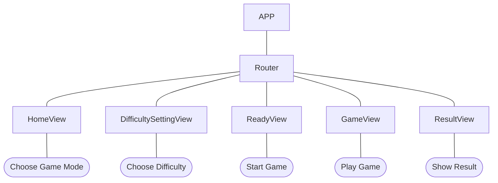

# Overview of the views of the application

```mermaid
flowchart TD
		APP[APP]
    Router[Router]
		HomeView[HomeView]
		GameView[GameView]
		ReadyView[ReadyView]
		ResultView[ResultView]
		DifficultySettingView[DifficultySettingView]

    APP --- Router
		Router --- HomeView
		Router --- DifficultySettingView
		Router --- ReadyView
		Router --- GameView
		Router --- ResultView

    HomeView --- HomeViewFunction([Choose Game Mode])
    DifficultySettingView --- DifficultySettingViewFunction([Choose Difficulty])
    ReadyView --- ReadyViewFunction([Start Game])
    GameView --- GameViewFunction([Play Game])
    ResultView --- ResultViewFunction([Show Result])
```
